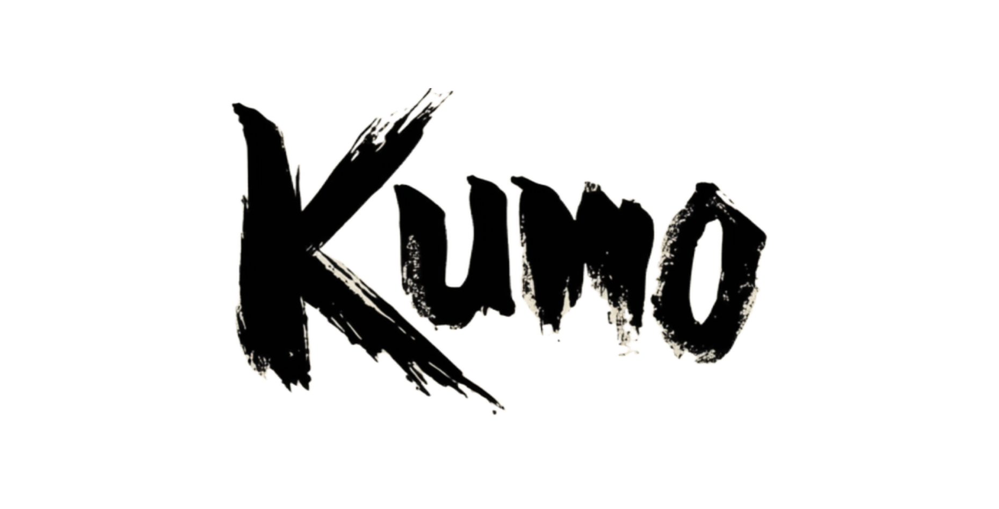
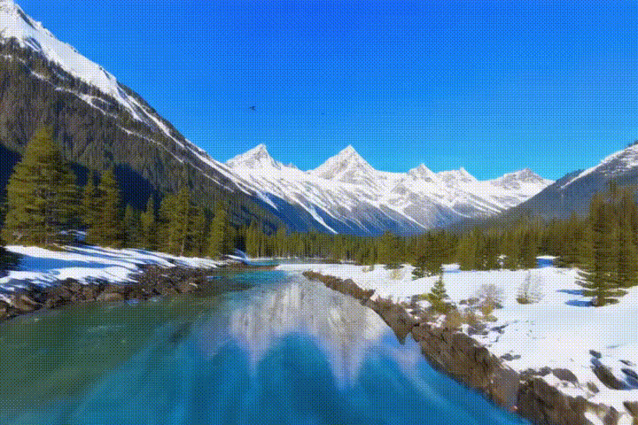
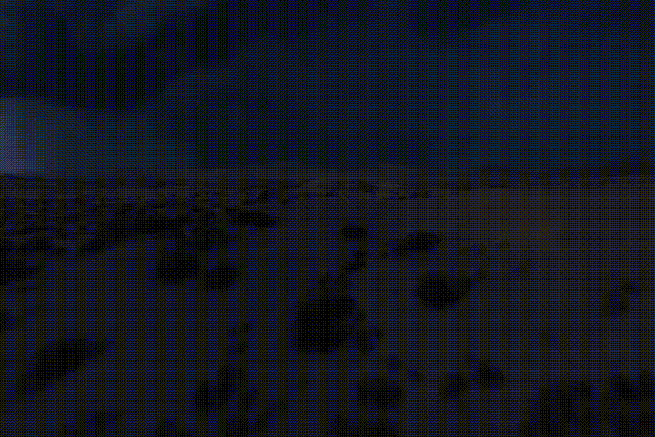
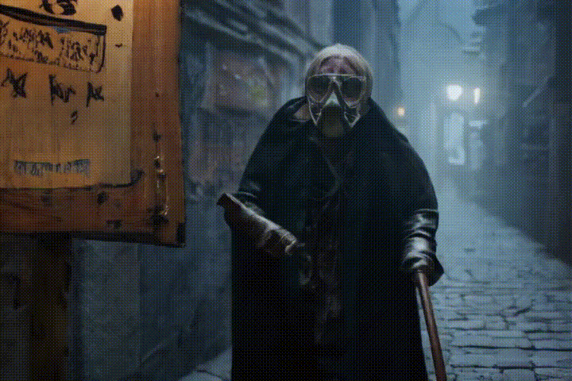

# KumoVideo: Video Generation with Mixed Attention Transformer

<p align="center">
  
</p>

**KumoVideo** is an open-source video generation framework based on Diffusion Transformer (DiT). We introduce MADiT (Mix Attention DiT), an advanced architecture that incorporates mix attention mechanisms to further elevate video generation quality and efficiency. KumoVideo demonstrates exceptional capability in producing high-fidelity, visually engaging, and temporally coherent videos, making it highly versatile for diverse applications across various domains. This repository empowers users to perform inference on KumoVideo using consumer-grade GPUs, democratizing access to cutting-edge video generation technology. We are honored to have open-sourced KumoVideo for the benefit of the community and remain dedicated to continuously refining and advancing the project to address the evolving demands of users and developers.

## 📑 To Do 

- ✅  Release inference code
- ✅  Release pre-trained models
- ✅  Release technical report
- ⏳  Release KumoVideo-Turbo
- ⏳  Support image conditioning
- ⏳  Release KumoVideo-Pro

## 🎥 Demo Video

Here are the video samples generated by KumoVideo. Each video has a duration of 5 seconds and a resolution of 480 &times; 720.

|  |  |  |
| - | - | - |
|  |  |  |
|  |  |  |

The prompts for the above cases, from left to right and top to bottom, are as follows. Feel free to try them out:

---

```
A breathtaking landscape unfolds, showcasing majestic snow-capped mountains in the foreground, their peaks glistening under a clear blue sky. A pristine river winds gracefully through the valley below, its crisp blue waters reflecting the towering mountains. Lush green pine trees dot the riverbanks, adding a vibrant contrast to the white snow. The scene transitions to a closer view of the river, revealing its crystal-clear current and the rocky bed beneath. In the distance, a waterfall cascades down a rocky cliff, merging seamlessly with the river, while a lone eagle soars above, completing this serene and untouched natural paradise.
A vast, serene blue ocean stretches to the horizon, where the sky is ablaze with the vibrant hues of a breathtaking sunset. The sun dips low, casting a golden glow that dances on the gentle waves, creating a mesmerizing play of light and shadow. The water's surface reflects the vivid colors of the sunset, blending shades of orange, pink, and purple, while the distant silhouette of a solitary sailboat adds a touch of tranquility. The scene is framed by a clear, unpolluted sky, with a few wispy clouds tinged with the sunset's radiant colors, evoking a sense of peace and natural beauty.
A high-definition drone soars over a vast, moonlit desert landscape, capturing the stark beauty of rolling dunes and sparse vegetation. Suddenly, a dramatic lightning bolt cracks the night sky, illuminating the desert in a brilliant, ephemeral glow. The drone tilts to reveal the intricate patterns of the dunes, highlighted by the contrasting shadows cast by the lightning. As the storm intensifies, multiple lightning strikes create a mesmerizing dance of light and shadow, transforming the serene desert into a dynamic, electrifying spectacle. The drone's perspective offers a breathtaking view of this natural phenomenon, emphasizing the raw power and majestic isolation of the desert under the tempestuous sky.
A middle-aged man with a neatly trimmed beard and glasses, dressed in a casual gray sweater and dark jeans, stands in a warmly lit, book-lined study. He insert both hands into pockets as he speaks passionately about a topic, his eyes sparkling with enthusiasm. The room features a large wooden desk cluttered with papers and a vintage typewriter, while a cozy armchair sits in the corner. Soft sunlight filters through a nearby window, casting a gentle glow on his face, highlighting his expressive features and the rich mahogany shelves filled with an array of books.
A cyclist in a sleek black helmet and aerodynamic gear pedals swiftly through a dense forest, his movements fluid and powerful. The video is a close-up of the face. The wind whistles past his ears, creating a symphony of forest motion, blending with the rustling leaves and distant bird calls. As he navigates the rugged, dirt road, the trees on either side appear to shift and morph, their glass-like facades reflecting the dynamic, ever-changing sky above. The cyclist's eyes, shielded by tinted goggles, remain focused and determined. From a low angle, the sky's clouds are seen moving continuously, adding a sense of motion and depth to the scene, as if the heavens themselves are in harmony with his journey.
A vibrant blue and white hologram pulses rhythmically above a focused oil rig worker, clad in a durable orange jumpsuit and safety helmet, meticulously repairing intricate equipment on the platform. The sun casts a golden glow over the scene, highlighting the worker's determined expression and the shimmering metallic surfaces. The serene ocean stretches out in the background, its calm waves reflecting the sunlight. The rig's towering structure looms in the foreground, while seagulls circle overhead, adding a touch of natural beauty to the industrious atmosphere. Camera zoom out.
In a lush, verdant jungle clearing, a majestic ape, its fur ranging from deep brown to golden hues, is seen peacefully walking around and eating leaves. It is male, with a distinctive silver mane, leads the way, meticulously selecting the freshest blades of grass. The sunlight filters through the dense canopy, casting dappled shadows on its expressive face, highlighting its contentment. The scene is serene, capturing the essence of its natural habitat and the simple joy of its primal sustenance.
In a luxurious, classic-style hotel room, the morning sun filters through sheer curtains, casting a warm glow on the elegant furnishings. A plush king-sized bed with a rich, velvet duvet and an array of decorative pillows stands to one side. Opposite the bed, a sumptuous sofa with intricate wood carvings and deep, inviting cushions beckons. Between these two focal points, a polished mahogany table is meticulously set for breakfast. Fine china, sparkling crystal glasses, and silver cutlery gleam under the soft light. A silver tray holds a steaming pot of coffee, a basket of freshly baked pastries, a bowl of fresh fruit, and a small vase with a single, vibrant rose. The room's opulent details, including ornate wallpaper, a crystal chandelier, and plush carpeting, create an atmosphere of timeless elegance and indulgence.
A somber doctor from the era of the Black Plague walks in a dimly lit, cobblestone alley, his face partially obscured by a beaked mask, the lenses of his glasses reflecting the flickering candlelight. He wears a long, dark cloak and leather gloves, clutching a wooden cane. Behind him, a weathered wooden signboard hangs on a crooked nail, inscribed with archaic symbols and warnings in faded ink. The alley's walls are lined with old, peeling posters and the distant sound of a town crier's voice adds to the eerie atmosphere, capturing the essence of a bygone, troubled time. Camera zooms out.
```

---

## 🌟 Overall Architecture

We use a 3D VAE to map the video from pixel space to latent space, then we patch the latent into tokens and concatenate them with the text tokens obtained from T5. These are then fed into our transformer backbone, and the output latent from the transformer is decoded to generate the video. Below is our overall architecture; for more specific details, please refer to our [technical report](./assets/docs/report.md).

<p align="center">
  
</p>

## 🔥 Local Deployment

You should build a python environment first:

    conda create -n KumoVideo python=3.10
    conda activate KumoVideo
    pip install -r requirements.txt

You can download the model [weights](https://huggingface.co/KumoAnonymous/KumoVideo). It includes the relevant weights and configuration files for the `language model`, `transformer`, `vae`, and `scheduler`. After downloading, place the files in the ckpt directory, and create a test directory within the project directory to store the results. 

    mkdir outputs

The structure of the entire directory will be as follows:

```
KumoVideo/
├── inference.py
├── run.sh
├── models/
├── ckpts/
    ├── scheduler/
    ├── text_encoder/
    ├── tokenizer/
    ├── transformer/
    ├── vae/
├── outputs/
```

Next, you only need to run the following command to perform inference:

    bash run.sh

You can generate the desired content by modifying the `pos_prompt`, and you can also add a negative prompt, change the number of inference steps, or set your own random seed. We provide the corresponding interfaces for all these options.

## 🔗 Citation

```bibtex
@software{KumoVideo,
  author = {Anonymous},
  title = {KumoVideo: Video Generation for Mixed Attention with Transformer},
  month = {December},
  year = {2024},
  url = {https://github.com/Kumo-Lab/KumoVideo}
}
```
