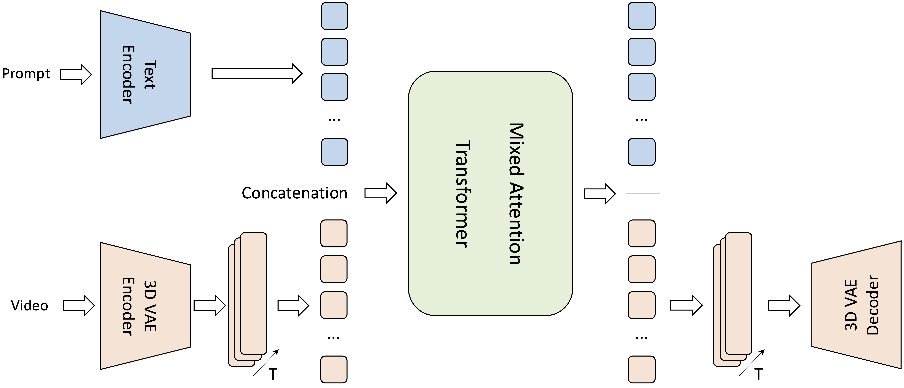
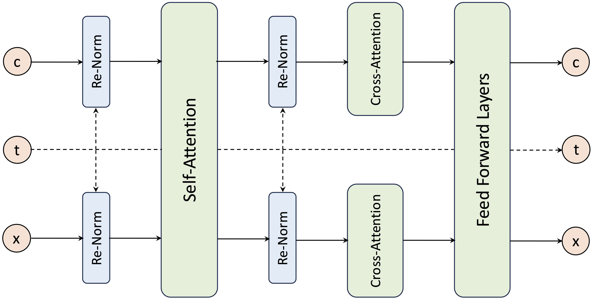
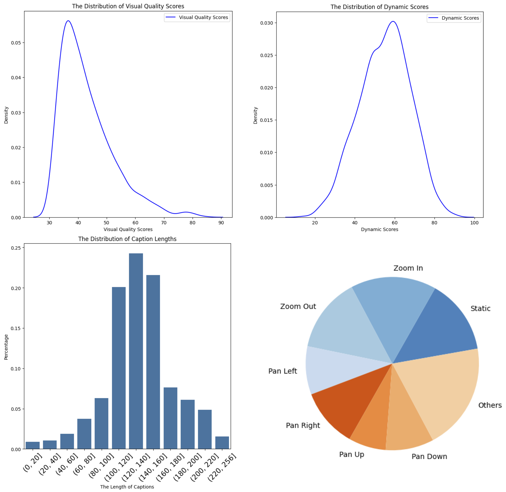

## 1. Introduction

Through comprehensive pre-training and cutting-edge architectures, diffusion models have achieved remarkable success in generating visual contents. In the field of video generation, countless diffusion model studies over the past two years have continuously pushed the boundaries of this domain. Initially, the community was primarily focused on open-source solutions; however, as the demand for improved model performance has risen, along with increasing computational and manpower costs, many state-of-the-art (SOTA) or leading models have become closed-source. This has created a significant gap between the open-source and closed-source communities, limiting free access to explore the potential of closed-source models. At the same time, the open-source community faces constraints in making innovative modifications to these closed-source models, which greatly hinders the advancement of the field.

To address this issue, we initiated a project called KumoVideo, an open-source video foundation model. Our aim is to provide a solution for the open-source community to advance the development of this field, and we will continually optimize and promote this project. KumoVideo is a video generation model based on DiT, specifically combining a 3D Variational Autoencoder (3D VAE) for efficient video compression and reconstruction with a Mixed Attention Diffusion Transformer (MADiT) for advanced denoising and video generation. We utilize T5 as our text encoder to capture complex semantic information. The synergy among these components allows KumoVideo to process large-scale video data with high computational efficiency while ensuring superior quality and temporal consistency in video outputs. By leveraging innovative architectural design, KumoVideo is specifically tailored for text-to-video generation.

## 2. KumoVideo Framework

### 2.1. Overview

Diffusion models generate visual content through iterative denoising. They consist of two main parts: the forward diffusion process $q$, which involves progressively applying Gaussian noise to clean samples $X_0$ over T timesteps, and the denoising process $p$, which continuously removes noise $X_T$ to recover clean samples $X_0$. These two processes are illustrated as follows:

$$q(X_t|X_0,t),\quad p_\theta(X_{t-1}|X_t,t), \quad where \ X_0 \sim p_{data}(X) \ and \ X_{T} \sim &Nu; (0, I) $$

The training objective of diffusion models can be formulated as:

$$loss=E_t\Vert{\epsilon - \epsilon_{\theta}(\sqrt{\overline{a}_t}X_0+\sqrt{1-\overline{a}_t}\epsilon, t)}\Vert^2$$

In the context of video generation, due to the complexity of video samples, latent diffusion models are typically employed. This approach first uses a VAE encoder to compress and encode pixel-level videos, which are then fed into the diffusion model for training and inference. The results obtained are subsequently decoded using the VAE decoder.

In KumoVideo, we use a 3D VAE to map the video from pixel space to latent space, then we patchify the latent into visual tokens and concatenate them with the text tokens obtained from T5. Then we feed these latents into our transformer backbone, and the output latent from the transformer is decoded to generate the video. Below is our overall architecture:

  

### 2.2. 3D VAE

Videos inherently combine spatial and temporal information, resulting in significantly larger data volumes compared to images. Existing widely used 2D VAEs struggle to understand temporal information, making it difficult to effectively encode and decode video data. To address this issue and reduce the computational demands of modeling video data, KumoVideo integrates a 3D VAE as a video compression module. The main features of the 3D VAE include:

- **High Compression Ratio**: Utilizes 3D convolutions to effectively reduce data size along both spatial and temporal dimensions, enabling efficient processing of high-resolution, long-duration videos. Specifically, we achieved a compression of 8 &times; 8 times in the spatial dimensions (width and height) and 4 times in the temporal dimension, resulting in an overall reduction of input complexity by 256 times. This significantly decreases the computational load on the transformer, accelerating both training and inference.
- **Improved Spatial Reconstruction**: Employs a pyramid structure to progressively encode spatial information layer by layer. The encoder and decoder each feature 3 layers of 2x downsampling and upsampling, a widely used design that preserves fine-grained details and ensures smooth motion continuity during video reconstruction, delivering superior fidelity compared to traditional compression methods.
- **Better Temporal Consistency**: Utilizes causal convolutions to capture temporal information from previous and subsequent frames. Compared to traditional convolution methods, this approach maintains temporal coherence, ensuring that motion and transitions in the reconstructed videos remain seamless and natural.

By integrating the 3D VAE into KumoVideo, the model achieves an optimized latent space representation, balancing computational efficiency with high-quality video reconstruction and generation capabilities.

### 2.3. Text Encoder

In multi-modality visual generative models, the ability to capture semantics is a crucial component. Common types of language models include encoder-only models like the CLIP language model, decoder-only models such as the GPT series, and encoder-decoder models like T5 series. 

We found that encoder-only language models struggle to understand complex semantic information, such as long prompts or prompts involving intricate relationships between objects. On the other hand, decoder-only and encoder-decoder models handle these scenarios more effectively. However, considering that decoder-only models typically require more computational power and have larger parameter sizes than equivalently performing encoder-decoder models, and some research indicates that encoder-decoder models offer superior feature representation capabilities compared to the other two types, we ultimately chose the encoder of T5-XXL, an encoder-decoder model, to encode our prompts.

### 2.4. Diffusion Transformer

KumoVideo utilizes transformer structure as its diffusion backbone. We present MADiT, a DiT based architecture that refines video representation using diffusion-based processes to generate high-quality, temporally coherent video outputs. This design efficiently captures spatial and temporal dependencies, ensuring robust and scalable video synthesis with reduced computational costs. The structure of the detailed model design is shown as below:

  

The main features of the proposed backbone include:

- **Visual Content Tokenization**: The 3D VAE encodes video latent into a tensor of shape $T\times{H}\times{W}\times{C}$, where T, H, W and C represent the number of frames, height, width, and the number of channels, respectively. To transform these latents into a sequence suitable for the transformer, KumoVideo patches the latents along the H and W dimensions, then flattens them in conjunction with the T dimension, resulting in a sequence of tokens $z_{vision}$ with a length of $\alpha\cdot{T}\cdot{H}\cdot{W}$, where $\alpha$ is the patching coefficient.
- **Latent Concatenation**: KumoVideo uses T5-XXL as the language model, merging the obtained text tokens $z_{text}$ with visual tokens $z_{vision}$ through concatenation, which serves as the input latent to the MADiT. This approach facilitates mixed attention operations, allowing for a fusion of text with spatial and temporal information. Additionally, this strategy is highly scalable, enabling further concatenation of various modality tokens.
- **Timestep Renormalization**: Considering that the diffusion model iteratively denoises through timesteps, KumoVideo employs timestep renormalization on the latent at each layer to enable MADiT to perceive different timesteps. The timestep t is embedded into $t_{embed}$, and then $t_{embed}$ is used to renormalize the text tokens $z_{text}$ and visual tokens $z_{vision}$ separately using AdaLN, where f is the scale and shift function.

$$f_{scale}(t_{embed})\cdot{z}+f_{shift}(t_{embed})$$

- **Attention Strategies**: KumoVideo employs both full self-attention and two seperate cross-attentions. For the full self-attention, it flattens and concatenates all text tokens $z_{text}$ and visual tokens $z_{vision}$ containing spatial and temporal information, followed by a full self-attention operation. For the two separate cross-attentions, it uses the text tokens $z_{text}$ or visual tokens $z_{vision}$ as queries, performing cross-attention operations with another set of tokens. The results are then fed into the feedforward layer after full self-attention.

$$SelfAttn(concat[z_{text}, z_{vision}])$$
$$CrossAttn_{1}(z_{text}, z_{vision}), CrossAttn_{2}(z_{vision}, z_{text})$$

## 3. Model Training and Inference

### 3.1. Progressive Training

KumoVideo Video adopts a progressive training strategy to efficiently handle the increasing complexity of generating high-resolution videos. The training process begins with a resolution of 360 &times; 480 and number of frames of 21, focusing on learning foundational spatiotemporal patterns and coarse details in a computationally efficient manner. Once the model achieves satisfactory performance at this resolution, it is incrementally fine-tuned on higher resolutions, culminating in video generation at 480 &times; 720 with 41 frames.

This progressive approach allows the model to gradually refine its understanding of finer spatial and temporal details while maintaining coherence across frames. By reducing computational demands in the early stages and leveraging knowledge transfer across resolutions, this method enhances scalability, accelerates convergence, and ensures high-quality results at higher resolutions.

### 3.2. Sampling Strategy

For the training loss, KumoVideo uses the v-prediction to minimize the difference between the predicted noise and the groundtruth. During the process of large-scale training, KumoVideo uniformly samples a timestep t from 1 to T. During the process of further fine-tuning, we discover from experiments that KumoVideo can achieve better results by adopting a cubic sampling strategy for the timestep, as follows:

$$t = (1-(\frac{t}{T})^3) \times T, \quad where\ t \in U(0, T)$$

### 3.3. Inference

With 2.6 billion parameters, KumoVideo can inference on consumer-grade GPUs, achieving good results with 50 steps. Below, we summarize the inference time, and GPU memory consumption under the conditions of a resolution of 480x720 and 41 frames. Specifically, we tested both the native version and the version using compiling on an RTX 4090 GPU, with half-precision:

Compile | Inference Time (bf16) | Inference Time (fp16) | VRAM (bp16) | VRAM (fp16) |
|---|:---:|:---:|:---:|:---:|
| No | 1.60s/step | 1.65s/step | 8.87GB | 8.99GB |
| Torch | 1.45s/step | 1.27s/step | 10.10GB | 12.14GB |
| NexFort | 1.37s/step | 1.18s/step | 10.30GB | 12.41GB |

## 4. Data Preprocessing

To support the training of KumoVideo, we collect, filter, and maintain a large-scale video dataset, each averaging about 10 seconds in length. We develop a custom data pre-processing pipeline for training our foundation models, which includes: Scene Transition Detection, Watermark Identification, Re-Captioning, Visual Quality Assessment, Dynamic Score Evaluation, Camera Movement Analysis, and Tailored Algorithms for Specific Scenarios and so on. To improve the quality and generalization of the generated videos, we also maintain an image-text dataset to incorporate into the training, which has extremely high visual quality and a very general domain.

- **Scene Transition Detection**: We leverage the scene detection models, while combining frame-differencing and semantic similarity analysis to accurately detect transitions between scenes. This approach enables us to produce training videos that feel seamless, minimizing the jarring effects of sudden cuts.
- **Watermark Identification**: To detect watermarks, on the one hand, we identify stationary watermarks through motion detection. On the other hand, we use OCR to recognize subtitles. By combining the two, we are able to filter out videos that contain unwanted watermarks or captions.
- **Re-Captioning**: We have developed our own video captioning model that can produce precise short captions, dense descriptions, and captions tailored for main objects and backgrounds, delivering thorough captioning information. Our team is discussing and evaluating whether this caption model will be open-source or not.
- **Visual Quality Assessment**: We employ aesthetic scoring along with various reference aesthetic datasets to set aesthetic standards for assessing the visual quality of videos during training.
- **Dynamic Score Evaluation**: We separate the subject from the background and apply similarity matching in RGB space and optical flow to calculate a dynamic score for the video, allowing us to eliminate static or minimally moving videos.
- **Camera Movement Analysis**: We leverage optical flow and inter-frame similarity matching to assess the direction and speed of camera movement in the video. This allows us to accurately extract camera parameters for training purposes.
- **Tailored Algorithms for Specific Scenarios**: We create specialized filtering and detection algorithms tailored for specific scenarios, including people speaking, eating, walking, expressing emotions, interacting with others, vehicle movements, and various lighting and shadow effects.

<figure>
	
</figure>

We utilize scene segmentation and watermark detection to initially clean the raw data. Subsequently, we further label and filter the data through recaptioning, Visual Quality Assessment, Dynamic Score Evaluation and Camera Movement Analysis. We present the data on our visual quality scores, dynamic scores, caption lengths, and the distribution of camera movements, as shown in the figure above. 

Based on these distributions, we conducted detailed segmentation and filtering to support the model's training during different phases: large-scale pre-training, small-scale fine-tuning, and progressive training. This approach ensures that the model maintains high generation quality while also learning to capture complete actions.

## 5. Future Work

Currently, KumoVideo is constantly developing and undergoing continuous updates. After comprehensive consideration, we have listed several goals for our next steps below:

- **KumoVideo-Turbo**: The existing KumoVideo performs well with 50 steps, but as the number of inference steps decreases, the model's performance gradually declines. To achieve faster inference, we plan to distill the current model to enable effective inference with fewer steps.
- **Image-to-Video**: Currently, KumoVideo only supports text as the conditioning input, functioning as a text-to-video model. However, image input is also a crucial condition that allows users to animate their images, facilitating more flexible video generation and interaction with the image community. To achieve this, we intend to introduce image tokens into the existing model, enabling an image-to-video functionality.
- **KumoVideo-Pro**: We also plan to release a version with a larger number of parameters, called KumoVideo-Pro. This model is currently undergoing review and evaluation, so stay tuned for updates!
