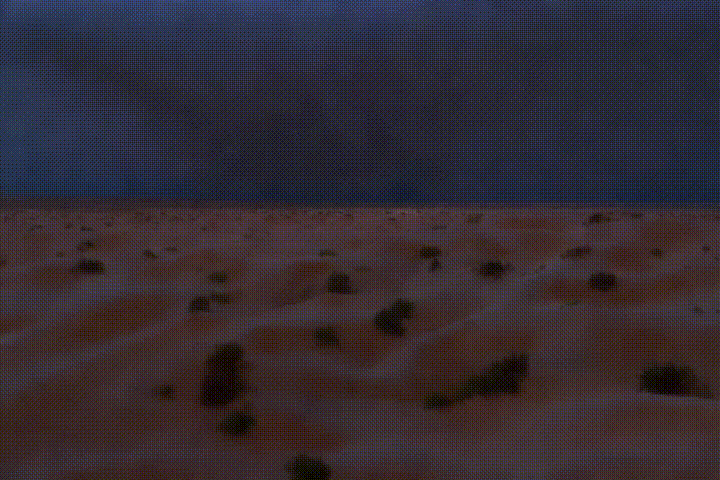

# KumoVideo-Turbo

**KumoVideo-Turbo** is a video generation framework based on the Diffusion Transformer (DiT), which incorporates the Latent Consistency Model (LCM) into the advanced KumoVideo model. The integration of LCM into KumoVideo-Turbo significantly accelerates inference speed, enabling the generation of high-quality videos in just 4-8 steps. Notably, KumoVideo-Turbo achieves a breakthrough in real-time video generation, producing 5-second videos at a resolution of 480 &times; 720, with a 6–12 &times; improvement over the original KumoVideo.

## Demo Video

Here are the video samples generated by KumoVideo-Turbo with only a few diffusion steps. Each video has a duration of 5 seconds and a resolution of 480 &times; 720.

|  |  |  |
| - | - | - |
|  |  |  |

The prompts for the above cases, from left to right and top to bottom, are as follows. Feel free to try them out:

---

```
A middle-aged man with a neatly trimmed beard and glasses, dressed in a casual gray sweater and dark jeans, stands in a warmly lit, book-lined study. He insert both hands into pockets as he speaks passionately about a topic, his eyes sparkling with enthusiasm. The room features a large wooden desk cluttered with papers and a vintage typewriter, while a cozy armchair sits in the corner. Soft sunlight filters through a nearby window, casting a gentle glow on his face, highlighting his expressive features and the rich mahogany shelves filled with an array of books.
A somber doctor from the era of the Black Plague walks in a dimly lit, cobblestone alley, his face partially obscured by a beaked mask, the lenses of his glasses reflecting the flickering candlelight. He wears a long, dark cloak and leather gloves, clutching a wooden cane. Behind him, a weathered wooden signboard hangs on a crooked nail, inscribed with archaic symbols and warnings in faded ink. The alley's walls are lined with old, peeling posters and the distant sound of a town crier's voice adds to the eerie atmosphere, capturing the essence of a bygone, troubled time. Camera zooms out.
A cyclist in a sleek black helmet and aerodynamic gear pedals swiftly through a dense forest, his movements fluid and powerful. The video is a close-up of the face. The wind whistles past his ears, creating a symphony of forest motion, blending with the rustling leaves and distant bird calls. As he navigates the rugged, dirt road, the trees on either side appear to shift and morph, their glass-like facades reflecting the dynamic, ever-changing sky above. The cyclist's eyes, shielded by tinted goggles, remain focused and determined. From a low angle, the sky's clouds are seen moving continuously, adding a sense of motion and depth to the scene, as if the heavens themselves are in harmony with his journey.
A high-definition drone soars over a vast, moonlit desert landscape, capturing the stark beauty of rolling dunes and sparse vegetation. Suddenly, a dramatic lightning bolt cracks the night sky, illuminating the desert in a brilliant, ephemeral glow. The drone tilts to reveal the intricate patterns of the dunes, highlighted by the contrasting shadows cast by the lightning. As the storm intensifies, multiple lightning strikes create a mesmerizing dance of light and shadow, transforming the serene desert into a dynamic, electrifying spectacle. The drone's perspective offers a breathtaking view of this natural phenomenon, emphasizing the raw power and majestic isolation of the desert under the tempestuous sky.
In a lush, verdant jungle clearing, a majestic ape, its fur ranging from deep brown to golden hues, is sitting on the ground and talking
As the sun dips low, powerful waves crash against rugged cliffs, sending foamy spray into the air. The scene unfolds in slow motion, capturing the raw energy of the ocean. The sky is a canvas of vibrant hues—deep purples, pinks, and golds—reflecting off the churning waters. Close-ups reveal the intricate textures of the cliff face, weathered by time and tide. The sound of the waves is thunderous yet soothing, creating a symphony of nature as the day transitions to night, leaving viewers mesmerized by the sheer beauty and power of the coastal landscape.
```

---

## Technical Detail

### Consistency Model

The **Consistency Model** (CM) nables one-step or few-step generation while maintaining the quality of generated images on the ImageNet dataset. A core principle of CM is ensuring the *self-consistency property*:

$$f(x_t, t) = f(x_{t'}, t'), \forall t,t' \in [\epsilon,T]. $$

This property allows any data point on a *Probability Flow Ordinary Differential Equation* (PF-ODE) trajectory to be mapped back to its origin.

<p align="center">
  
</p>

The **Latent Consistency Model** builds upon the success of CM, extending its benefits to Stable Diffusion for the Text-to-Image generative task. LCM accelerates the reverse sampling process by directly predicting the solution of the augmented PF-ODE in latent space. It combines several effective techniques, such as One-Stage Guided Distillation and the Skipping-Step Technique, to achieve exceptional inference speed and rapid training convergence in Stable Diffusion models.

### Training Strategy

We modify the original LCM training strategy from $\epsilon$-Prediction to v-Prediction to align with the prediction target of KumoVideo. For improved performance and simplified implementation, we employ a constant guidance scale, as opposed to the more complex CFG embeddings.

With the powerful capabilities of the base KumoVideo model, the training converges quickly, reaching a high level of quality in a short time.

### Inference Efficiency

KumoVideo-Turbo successfully generates 5-second videos at a resolution of 480 × 720 in real-time on an RTX 4090 GPU, utilizing half-precision and NexFort compilation.

We would like to emphasize how liberating it is to explore video generation with such ease and efficiency using KumoVideo-Turbo.

Model | No Compile | Torch | NexFort |
| --- |:---:|:---:|:---:|
| KumoVideo | 82.5s | 63.5s | 59s |
| KumoVideo-Turbo (8 steps) | 13.2s | 10.16s | 9.44s |
| KumoVideo-Turbo (4 steps) | 6.6s | 5.08s | 4.72s |
